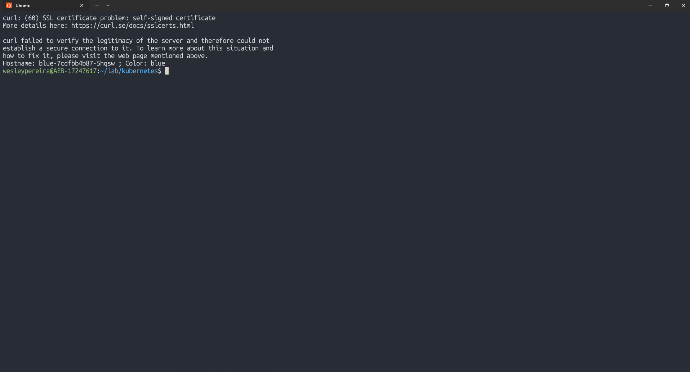

# Atividade 08 — Redes no Kubernetes: Ingress com HTTPS

## 1. Contexto do ambiente

O roteiro original do curso (Escola Superior de Redes / RNP) usa VMs com Vagrant e o CNI **Weave Net**.
Neste laboratório o cluster roda com **kind** (Kubernetes em containers Docker) no WSL2.

Consequências:

- O CNI do kind é o `kindnet`, então os exercícios específicos do Weave Net (IPAM, `weave-npc`, interface `weave`) não foram reproduzidos.
- O instalador do Weave via `cloud.weave.works` não está mais disponível.
- O foco prático foi o **Ingress com TLS**, que é a entrega da atividade.

## 2. Conceitos estudados

### CNI (Container Network Interface)

- O `kubelet` usa um único plugin de rede, definido por `network-plugin=cni`.
- Binários dos plugins ficam em `/opt/cni/bin` (`--cni-bin-dir`).
- A configuração fica em `/etc/cni/net.d` (`--cni-conf-dir`); o campo `type` do arquivo indica qual binário é executado.
- Sem plugin de rede instalado, o pod fica em `ContainerCreating` com `networkPlugin cni failed to set up pod`.

### Redes de serviços

- O `kube-proxy` roda como DaemonSet (um pod por node) e, em Linux, usa `iptables` por padrão quando `mode` está vazio.
- Fluxo de um ClusterIP: `KUBE-SERVICES` → `KUBE-SVC-*` → `KUBE-SEP-*`, onde uma regra **DNAT** reescreve destino para IP:porta do pod.
- NodePort: tráfego que não casa com o ClusterIP cai em `KUBE-NODEPORTS` e segue para a mesma chain `KUBE-SVC-*`.
- Faixa padrão de NodePort: 30000–32767.

### CoreDNS

- Serviço `kube-dns` no namespace `kube-system` (ClusterIP `10.96.0.10` no ambiente do curso).
- O IP chega ao pod via `clusterDNS` no `/var/lib/kubelet/config.yaml` e aparece em `/etc/resolv.conf`.
- Configuração no ConfigMap `coredns`; domínio-raiz `cluster.local`.

### Ingress

- Expõe HTTP/HTTPS de fora do cluster para Services internos, com regras de roteamento.
- Precisa de um **Ingress Controller** (aqui, `ingress-nginx`) para cumprir as regras.
- Não serve para outros protocolos/portas; para isso, usar NodePort ou LoadBalancer.

## 3. Execução

### 3.1 Cluster com mapeamento de portas

A porta 80 do host estava ocupada (ver problemas), então foram usadas **8080/8443**.

Manifesto: [`manifests/atividade-08/kind-ingress.yaml`](manifests/atividade-08/kind-ingress.yaml)

```bash
kind create cluster --name ingress --config kind-ingress.yaml
kubectl apply -f https://raw.githubusercontent.com/kubernetes/ingress-nginx/controller-v1.12.1/deploy/static/provider/kind/deploy.yaml
kubectl -n ingress-nginx wait --for=condition=ready pod -l app.kubernetes.io/component=controller --timeout=180s
```

### 3.2 Aplicações blue e red

```bash
kubectl create ns color
for c in blue red; do
  kubectl -n color create deploy $c --image=fbscarel/myapp-color:$c --replicas=1
  kubectl -n color expose deploy $c --port=80
done
```

### 3.3 Certificado autoassinado e Secret TLS

```bash
openssl req -x509 -nodes -days 365 -newkey rsa:4096 -keyout color.key -out color.crt \
  -subj "/CN=*.color.contorq.com/O=*.color.contorq.com"
kubectl -n color create secret tls color-tls --cert color.crt --key color.key
```

> A chave privada (`color.key`) e o certificado **não** são versionados.

### 3.4 Ingress com TLS e redirect

Manifesto: [`manifests/atividade-08/ingress-color-tls.yaml`](manifests/atividade-08/ingress-color-tls.yaml)

```bash
kubectl apply -f ingress-color-tls.yaml
kubectl -n color get ingress
```

Diferença em relação ao roteiro: uso de `ingressClassName: nginx` no lugar da annotation `kubernetes.io/ingress.class`, que está deprecada.

## 4. Teste e evidência

Como o domínio não existe em DNS, foi usado `--resolve` do curl no lugar de editar o `/etc/hosts`.

```bash
curl --resolve blue.color.contorq.com:8443:127.0.0.1 https://blue.color.contorq.com:8443/color
curl -sk --resolve blue.color.contorq.com:8443:127.0.0.1 https://blue.color.contorq.com:8443/color
```

Resultado:

- Sem `-k`: `SSL certificate problem: self-signed certificate` (esperado, certificado autoassinado).
- Com `-k`: `Hostname: blue-... ; Color: blue`.



## 5. Problemas encontrados

### Porta 80 do host ocupada

`kind create cluster` falhou com `ports are not available: exposing port TCP 0.0.0.0:80`. Nenhum container Docker usava a porta; quem ocupava era o host (WSL2/Windows).
**Solução:** mapear `hostPort` 8080 e 8443.

### `kubectl apply` executado no cluster errado

Ao encadear comandos sem `&&`, o `apply` do ingress-nginx rodou mesmo com a criação do cluster falhando, e foi aplicado no contexto anterior (`kind-lab-s2`).
**Solução:** remover os recursos aplicados (namespace, IngressClass, webhook, ClusterRole/Binding) e usar `&&` entre os passos, além de conferir `kubectl config current-context`.

### `wait` falhando logo após o `apply`

`error: no matching resources found`: o pod do controller ainda não existia.
**Solução:** repetir o `wait` após alguns segundos.

## 6. Aprendizados

- Em produção o Ingress depende de DNS externo, balanceador/proxy nas portas 80/443 e certificados válidos (CA confiável).
- Com portas mapeadas direto no kind, o redirect HTTP→HTTPS funciona sem a limitação de porta do roteiro original.
- O projeto `ingress-nginx` foi anunciado como em descontinuação; vale acompanhar a **Gateway API** como alternativa. Confirmar o status atual antes de adotar em projetos novos.
- Encadear comandos com `&&` e conferir o contexto do `kubectl` evita aplicar recursos no cluster errado.
