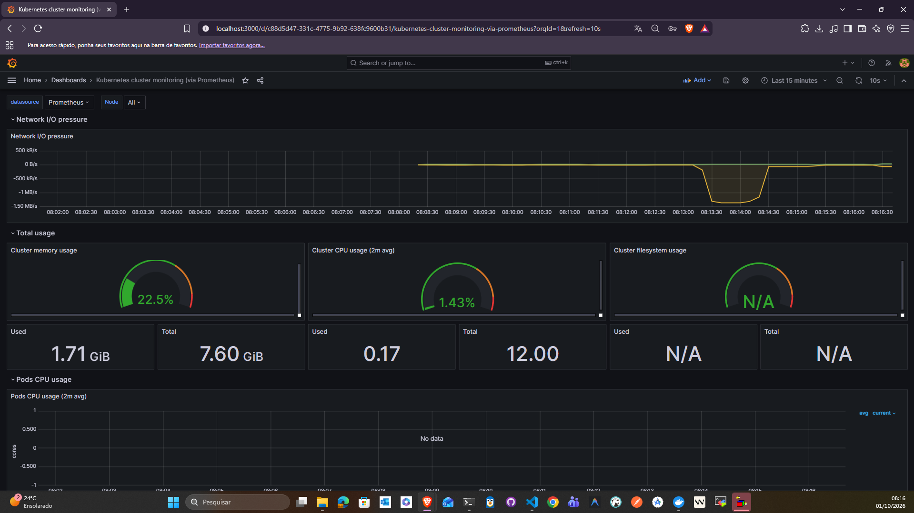

# Atividade 09 — Resolução de problemas: Monitoramento e Observabilidade

## 1. Conceito

Ferramentas leves como Kubebox ou o Kubernetes Dashboard atendem ambientes pequenos. Com mais usuários, deployments e recursos, é necessário **observabilidade**: a combinação mais comum é **Prometheus** (métricas) + **Grafana** (visualização) + **Loki** (logs), instalada aqui com **Helm**.

- **Kubebox:** TUI para ver pods, eventos (`e`) e abrir shell (`r`). Precisa do cAdvisor para mostrar CPU/memória/rede/disco.
- **Helm:** gerenciador de pacotes (charts) do Kubernetes, que simplifica a instalação da stack inteira.

Nesta atividade o Kubebox não foi executado; o foco foi Grafana + Loki + Prometheus (entrega da atividade).

## 2. Execução

Cluster utilizado: `kind-ingress` (mesmo da Atividade 08).

```bash
helm repo add grafana https://grafana.github.io/helm-charts && helm repo update
kubectl create ns grafana

helm upgrade --install loki grafana/loki-stack -n grafana \
  --set grafana.enabled=true,prometheus.enabled=true,prometheus.alertmanager.persistentVolume.enabled=false,prometheus.server.persistentVolume.enabled=false

kubectl -n grafana get pod -w
```

Pods criados: `loki`, `loki-grafana`, `loki-prometheus-server`, `loki-prometheus-alertmanager`, `loki-prometheus-pushgateway`, `loki-prometheus-node-exporter`, `loki-kube-state-metrics` e `loki-promtail`. Todos ficaram `Running`.

### Acesso ao Grafana

Em vez de um Service NodePort, foi usado `port-forward` restrito ao loopback:

```bash
kubectl -n grafana get secret loki-grafana -o jsonpath="{.data.admin-password}" | base64 -d; echo
kubectl -n grafana port-forward svc/loki-grafana 3000:80
```

Acesso em `http://localhost:3000` com o usuário `admin`.

### Datasources e dashboard

- O chart já cadastra **Loki** e **Prometheus** como data sources.
- Dashboard importado: **3119** (*Kubernetes cluster monitoring via Prometheus*), em *Dashboards > New > Import*, apontando para o datasource Prometheus.

## 3. Evidência



## 4. Problemas e observações

- **Chart deprecado:** o Helm avisa `this chart is deprecated` para o `loki-stack`. Funciona para laboratório, mas em projetos novos usar os charts atuais do Loki/Alloy.
- **Painel "Pods CPU usage" sem dados:** o dashboard 3119 é antigo e usa os labels `pod_name` e `container_name`, que o Kubernetes atual renomeou para `pod` e `container`.
- **Painel de filesystem N/A:** comportamento também mostrado no material do curso.
- **Segurança do acesso:** `port-forward` em `127.0.0.1` evita expor o Grafana para a rede; o uso de `--address 0.0.0.0` foi descartado.
- A senha do admin gerada pelo chart **não** deve ser registrada no repositório.

## 5. Aprendizados

- Helm reduz a instalação de uma stack de observabilidade a um comando.
- Dashboards da comunidade aceleram o início, mas precisam ser validados contra a versão de métricas do cluster.
- Para ambientes maiores, outros dashboards úteis: ingress controller, Kafka exporter e Istio.
